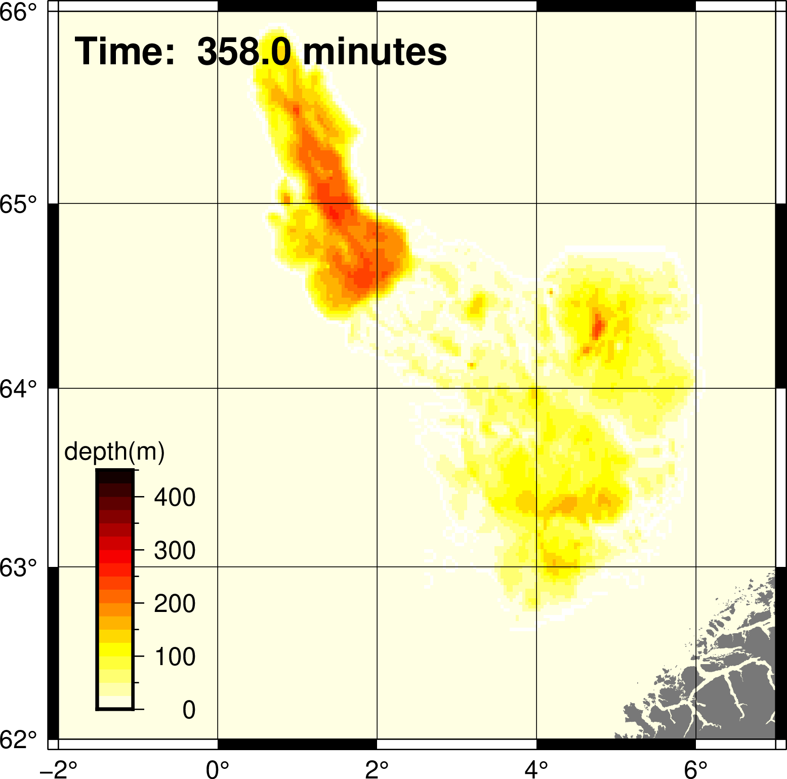

**BingCLAW fort file display example**


The BingClaw program writes out files with names fort.*

There are many different approaches to processing and visualizing these files; a familiarity with ClawPACK is useful here.

This directory contains one ad-hoc solution to converting and visualizing an output from the Storegga simulation using GMT software https://www.generic-mapping-tools.org/ 

It consists of a bash script *one_fortfile_2_png.sh* and three python scripts:

```
claw2file3.py
format3.py
sct3/io.py
```

The execution takes the form:  

```
USAGE: 
./one_fortfile_2_png.sh   ./fort.q0179 
```

but you will need to adjust paths for GMT and install all of the python dependencies.  

If successful, you should end up with a figure resembling this one:  

!
