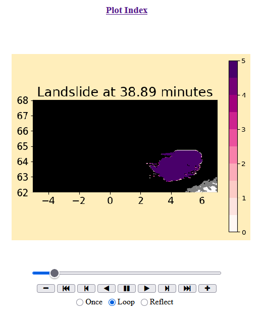

This folder contains a sample setplot.py file should you prefer to use the clawpack plotting system.  

All output (fort.*) files must be in a folder _output.  

Typing 
```
make plots
```
will generate png, tex, and html files and can be animated from within a web-browser.


